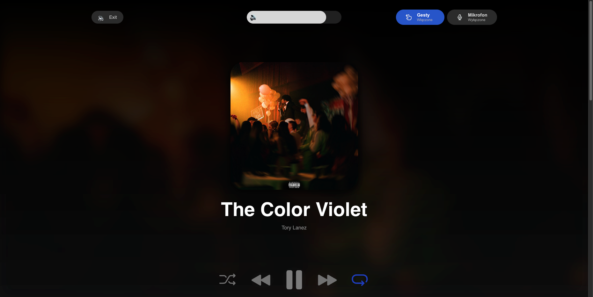
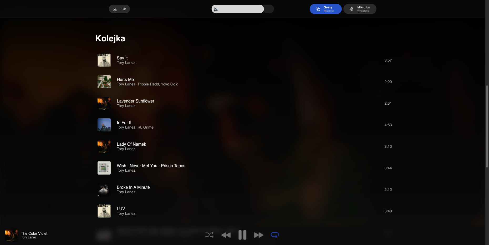
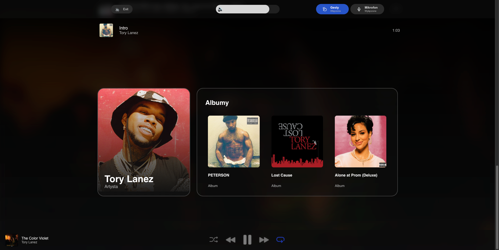

# Accessible Spotify Controller

A web application that empowers people with disabilities to control Spotify using hand gestures, voice commands, and screen reading — all while complying with **WCAG 2.1 AA** accessibility standards.

## 🚀 Features

- ✋ **Gesture-based control** (via webcam + MediaPipe)
- 🎙️ **Voice control** (SpeechRecognition + commands)
- 🧏‍♂️ **Screen reader support** (pyttsx3 or gTTS)
- 🎨 **Accessible UI** meeting WCAG 2.1 AA standards (contrast, structure, focus)
- 📡 **Live Spotify player data** using Spotify Web API
- ⚙️ **Dynamic controls** for play/pause, skip, volume, etc.

## 💡 Why this project?

Many music platforms are not fully accessible for people with visual, motor or cognitive disabilities. This project was created as part of my engineering thesis to solve that — blending **AI-powered interactions** with **inclusive design principles**.

## 🧱 Built With

- **Frontend**: HTML/CSS/JS (custom UI)
- **Backend**: Python
- **Libraries**:  
  - `MediaPipe` – gesture detection  
  - `SpeechRecognition` – voice input  
  - `pyttsx3` / `gTTS` – text-to-speech  
  - `requests` – communication with Spotify Web API  
- **Accessibility guidelines**: [WCAG 2.1 AA](https://www.w3.org/WAI/WCAG21/quickref/)

## 📷 Demo

  
  
  
> Live demo and YouTube walkthrough coming soon!

## 🛠️ How to Run

```bash
# 1. Install dependencies
pip install -r requirements.txt

# 2. Run the app
python app.py
```

Make sure to add your Spotify API keys in the `config.py`.

## ✅ Accessibility Checklist (WCAG 2.1 AA)

- ✅ Color contrast (4.5:1)
- ✅ Resizable text
- ✅ Screen reader compatibility
- ✅ Keyboard navigation
- ✅ Clear visual focus states

## 📄 License

MIT – free to use, modify, share. Just don’t forget to give credit 😉
